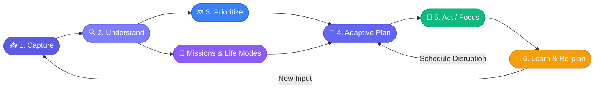
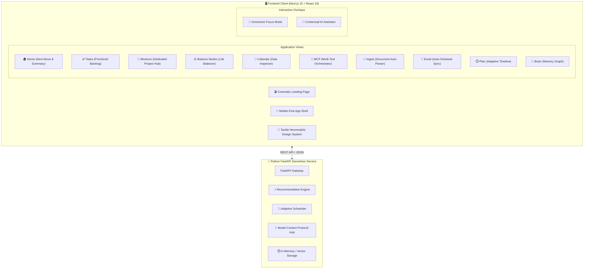

<div align="center">

```text
 ███████╗ ██╗       ██████╗  ██╗    ██╗
 ██╔════╝ ██║      ██╔═══██╗ ██║    ██║
 █████╗   ██║      ██║   ██║ ██║ █╗ ██║
 ██╔══╝   ██║      ██║   ██║ ██║███╗██║
 ██║      ███████╗ ╚██████╔╝ ╚███╔███╔╝
 ╚═╝      ╚══════╝  ╚═════╝   ╚══╝╚══╝ 
    FOCUS · LOGIC · ORCHESTRATION · WORKFLOW
```


<br/>

<p align="center">
  
  &nbsp;
  
  &nbsp;
  
  &nbsp;
  
</p>

<p align="center">
  
  &nbsp;
  
  &nbsp;
  
  &nbsp;
  
  &nbsp;
  
  &nbsp;
  
  &nbsp;
  
</p>

<br/>

<p align="center">
  <em><strong>An intelligent personal AI execution companion that transforms scattered daily commitments<br/>into an adaptive, prioritized plan — and answers the only question that matters:</strong></em>
</p>

<h2 align="center">
  
</h2>

<br/>

<p align="center">
  <a href="#-the-flow-paradigm">Paradigm</a> &nbsp;•&nbsp;
  <a href="#-core-modules--feature-suite">Feature Suite</a> &nbsp;•&nbsp;
  <a href="#%EF%B8%8F-system-architecture">Architecture</a> &nbsp;•&nbsp;
  <a href="#-design-system">Design System</a> &nbsp;•&nbsp;
  <a href="#-quick-start">Quick Start</a> &nbsp;•&nbsp;
  <a href="#-api-reference">API Reference</a> &nbsp;•&nbsp;
  <a href="#%EF%B8%8F-roadmap">Roadmap</a>
</p>

</div>

<br/>

---

## 🧠 The FLOW Paradigm

> *Most productivity tools are passive archives. FLOW is an active execution engine.*

Traditional tools pile tasks into an ever-growing inbox. FLOW continuously asks, answers, and adapts — cutting through noise to surface the single most valuable action at any point in time.

<div align="center">

```text
        INPUT                     INTELLIGENCE                     OUTPUT
┌─────────────────────┐       ┌──────────────────────┐       ┌─────────────────────┐
│  14 Unread Tasks    │       │                      │       │  ▶ START NOW        │
│  Overdue Project    │  ───► │  "What should I do   │  ───► │    Finish DBMS      │
│  3pm Meeting        │       │     right now?"      │       │    (35m Focus Box)  │
│  Cognitive Overload │       │                      │       │  ✓ Auto Re-planned  │
└─────────────────────┘       └──────────────────────┘       └─────────────────────┘
      CHAOS                        THE QUESTION                     CLARITY
```

</div>

### ⚙️ The Continuous Execution Cycle



<br/>

---

## 🌟 Core Modules & Feature Suite

```text
========================================================================================
 MODULE                             CAPABILITIES & HIGHLIGHTS
========================================================================================
 01. Today & Next Move Engine       Immediate single-point execution clarity with "Why Now?" reasoning.
 02. Tasks Matrix                   Subtask milestones, priority filters, and duration chips.
 03. Missions & Projects Hub        Self-contained project workspaces with dedicated sub-flows.
 04. Cognitive Life-Mode Balancer   Select & combine archetypes (Academic, Startup, Deep Work, Crunch).
 05. Calendar & Day Inspector       Interactive monthly/weekly grid with date-level inspection.
 06. AI MCP Orchestrator            Gateway for Google Calendar, GitHub, Notion, Postgres, Brave Search.
 07. Document & Data Ingest         Drag-and-drop syllabus/PDF parser to automated task backlogs.
 08. Email Auto-Scheduler           Inbox scanner detecting deadlines with 1-click schedule saving.
 09. Brain Knowledge Graph          Long-term memory index of habits, rhythms, and preferences.
 10. Focus Chamber                  Mechanical stopwatch timer, milestone pins & Alpha wave audio.
========================================================================================
```

### 🚀 Missions & Dedicated Project Workspaces
Each Mission acts as a full self-contained sub-environment (like ChatGPT Projects):
- **Milestone Phases**: *Phase 1: Architecture* → *Phase 2: Implementation* → *Phase 3: Delivery*.
- **Dedicated Task Stream**: Scoped task backlog with duration chips and subtasks.
- **Dedicated Interactive Calendar**: Project schedule tracking review deadlines.
- **Docs & Tools Hub**: Attached project specifications, SQL schemas, and notes.
- **Scoped Project AI Co-Pilot**: AI assistant pre-loaded with project context.

### ⚖️ Cognitive Balance & Life Modes
Toggle and synthesize multi-mode schedules:
- **Academic Balance**: 35m study sprints and spaced retention.
- **Startup & Founder**: 25m execution blitzes and agile customer buffers.
- **Engineering Deep Work**: 60–90m uninterrupted coding blocks.
- **Exam & Launch Crunch**: Rapid deadline triage for immediate deliverables.
- **Multi-Mode Combination**: Combine *Academic + Startup* to balance school with building a product!

---

## 🏗️ System Architecture

FLOW uses a clean decoupled monorepo architecture — separating the Next.js client from the Python serverless backend.



---

## 🎨 Design System & Aesthetics

| Element | Specification | Implementation Detail |
|:---|:---|:---|
| **Aesthetic System** | Modern Tactile Neumorphism | Dual-directional lighting, micro-rim highlights, soft dual shadows |
| **Light Theme** | Warm Ivory & Alabaster (`#F7F5F0`) | Museum-grade soft paper tone eliminating harsh white glare |
| **Dark Theme** | Obsidian Black + White Grid (`#07080A`) | High-definition `28px` architectural grid with indigo ambient aura |
| **Button Geometry** | Smooth Capsule Rectangles | Pill-shaped `rounded-full` surfaces with multi-layer shadow depth |
| **Iconography** | Zero Unicode Emojis | 100% precision Lucide vector iconography |
| **Page Rendering** | Instant Direct Rendering | Zero loading screen latency for immediate page transitions |

---

## 🚀 Quick Start

### 1️⃣ Clone & Install

```bash
git clone https://github.com/srinivas2s/flow.git
cd flow
```

### 2️⃣ Run Full Workspace (Monorepo)

```bash
# Install frontend dependencies
cd frontend
npm install

# Run frontend dev server
npm run dev
```

> ✅ Frontend live at **http://localhost:3000**  
> ✅ Application workspace at **http://localhost:3000/app**

### 3️⃣ Run Backend Service (Optional)

```bash
# From project root
python -m venv venv

# Windows
.\venv\Scripts\activate

# macOS / Linux
source venv/bin/activate

pip install -r requirements.txt
uvicorn api.index:app --reload --port 8000
```

> ✅ API live at **http://localhost:8000** — Swagger UI at **http://localhost:8000/docs**

---

## 📡 API Reference

<details>
<summary><strong>🔍 View Full API Table</strong></summary>

<br/>

| Method | Endpoint | Description |
|:---:|:---|:---|
| `GET` | `/api/health` | Healthcheck & system status |
| `GET` | `/api/tasks` | Fetch all tasks & priorities |
| `POST` | `/api/tasks` | Create a new task |
| `PATCH` | `/api/tasks/{id}` | Update task status or details |
| `DELETE` | `/api/tasks/{id}` | Remove a task |
| `GET` | `/api/plan` | Fetch adaptive daily timeline |
| `POST` | `/api/plan/recalculate` | Trigger dynamic re-plan |
| `POST` | `/api/ai/recommend` | Compute "What should I do right now?" |
| `POST` | `/api/focus/start` | Initialize a focus session |
| `POST` | `/api/focus/complete` | Record a completed session |
| `GET` | `/api/memories` | Retrieve productivity context graph |

</details>

---

## 📄 License

Distributed under the **MIT License** — see the [LICENSE](./LICENSE) file for details.

<br/>

<div align="center">


<br/>

**FLOW** — *Focus · Logic · Orchestration · Workflow*

<sub>Designed with precision for human cognitive clarity.</sub>

<br/>

<sub>Made with ❤️ by <a href="https://github.com/srinivas2s">srinivas2s</a></sub>

</div>
