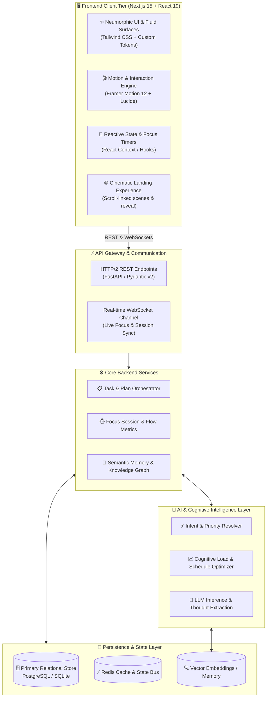

<div align="center">

```
  ███████╗██╗      ██████╗ ██╗    ██╗
  ██╔════╝██║     ██╔═══██╗██║    ██║
  █████╗  ██║     ██║   ██║██║ █╗ ██║
  ██╔══╝  ██║     ██║   ██║██║███╗██║
  ██║     ███████╗╚██████╔╝╚███╔███╔╝
  ╚═╝     ╚══════╝ ╚═════╝  ╚══╝╚══╝ 
```

# **FLOW**
### *The Intelligent, Flow-State First Productivity & Cognitive Management System*

<p align="center">
  <b>Eliminate Decision Paralysis. Enter Frictionless Deep Work. Master Your Cognitive Rhythm.</b>
</p>

[](https://nextjs.org/)
[](https://react.dev/)
[](https://www.typescriptlang.org/)
[](https://tailwindcss.com/)
[](https://www.framer.com/motion/)
[](https://fastapi.tiangolo.com/)
[](LICENSE)

<br/>

[✨ Features](#-key-features) • [🏛️ Architecture](#-system-architecture) • [🛠️ Tech Stack](#️-technology-stack) • [🚀 Quick Start](#-quick-start) • [📁 Directory Structure](#-directory-structure) • [🎨 Design System](#-design-system--aesthetics) • [🗺️ Roadmap](#-roadmap)

---

</div>

<br/>

## 🌌 Overview

Modern productivity tools often contribute to the exact problem they claim to solve: **fragmentation, micro-management overhead, and decision fatigue**. 

**FLOW** is engineered as an adaptive, cognitive co-pilot. Instead of forcing you to navigate sprawling lists and complex matrices, FLOW synthesizes your goals, context, and mental energy into a single question answered with surgical clarity:

> **"What should I do right now?"**

Built on top of a cutting-edge **Neumorphic & Fluid design system**, FLOW blends soft tactile surfaces with intelligent state tracking, ambient focus modes, and frictionless AI task synthesis.

---

## ✨ Key Features

<table>
  <tr>
    <td width="50%" valign="top">
      <h3>🎯 Single-Action Focus Engine</h3>
      <ul>
        <li><b>"What Now?" Solver:</b> Instant dynamic task selection based on deadline, importance, and current energy levels.</li>
        <li><b>Cognitive Load Balancing:</b> Auto-slices overwhelming projects into atomic, low-friction micro-actions.</li>
      </ul>
    </td>
    <td width="50%" valign="top">
      <h3>🧠 Adaptive AI Brain & Memory</h3>
      <ul>
        <li><b>Natural Thought Capture:</b> Dump raw brain dumps, audio memos, or chaotic notes; the AI parses intent, urgency, and category.</li>
        <li><b>Contextual Memory:</b> Learns your peak productive hours and work rhythms over time.</li>
      </ul>
    </td>
  </tr>
  <tr>
    <td width="50%" valign="top">
      <h3>🌊 Deep Flow State Chamber</h3>
      <ul>
        <li><b>Distraction-Free Focus Mode:</b> Fullscreen immersive workspace with fluid Pomodoro / Flow timers.</li>
        <li><b>Ambient Soundscapes:</b> Generative focus audio and rewarding celebratory micro-interactions with canvas confetti.</li>
      </ul>
    </td>
    <td width="50%" valign="top">
      <h3>🎨 Neumorphic Tactile Interface</h3>
      <ul>
        <li><b>Bi-Directional Theming:</b> Seamless dark and light themes with calibrated ambient shadows and luminescence.</li>
        <li><b>Kinetic Micro-Interactions:</b> 60fps spring animations powered by Framer Motion.</li>
      </ul>
    </td>
  </tr>
</table>

---

## 🏛️ System Architecture

FLOW is architected with a high-performance, decoupled client-server model separating user interaction, ambient state synchronization, and background AI inference.



---

## 🛠️ Technology Stack

| Domain | Technology | Details |
| :--- | :--- | :--- |
| **Frontend Framework** | `Next.js 15 (App Router)` | High-performance React framework with Turbopack & SSR |
| **UI Library** | `React 19` | Modern concurrent rendering and hooks |
| **Language** | `TypeScript 5.7` | Strict type safety across components and models |
| **Styling** | `Tailwind CSS 3.4` | Custom neumorphic shadows (`neu-raised`, `neu-pressed`, `neu-glow`) |
| **Animations** | `Framer Motion 12` | Physics-based spring animations, layout transitions & gestures |
| **Iconography** | `Lucide React` | Clean, customizable modern icon suite |
| **Delight / FX** | `Canvas Confetti` | Particle fireworks celebrating task completion |
| **Backend Engine** | `FastAPI (Python 3.11+)` | Asynchronous, OpenAPI-native web framework |
| **Validation** | `Pydantic v2` | High-performance data schemas and serialization |
| **Persistence** | `PostgreSQL / SQLite` | Robust relational modeling with SQLAlchemy |
| **Caching / Sessions**| `Redis` | In-memory session tracking and instant synchronization |

---

## 🎨 Design System & Aesthetics

FLOW utilizes a custom-designed **Neumorphic Minimalist Design System** crafted with soft dimensional lighting, subtle luminescence, and accessible contrast ratios.

```
       LIGHT MODE                             DARK MODE
 ┌──────────────────────┐              ┌──────────────────────┐
 │  Surface: #F3F4F6    │              │  Surface: #12141A    │
 │  Raised:  2-Point    │  ───────►    │  Raised:  Deep Dark  │
 │  Border:  Translucent│              │  Glow:    Indigo/Cyan│
 │  Accent:  #6366F1    │              │  Accent:  #818CF8    │
 └──────────────────────┘              └──────────────────────┘
```

### Custom Tailwind Utility Shadows
```css
/* Neumorphic Lighting Model */
--neu-shadow-raised: 8px 8px 16px var(--shadow-dark), -8px -8px 16px var(--shadow-light);
--neu-shadow-pressed: inset 4px 4px 8px var(--shadow-dark), inset -4px -4px 8px var(--shadow-light);
--neu-shadow-glow: 0 0 20px rgba(99, 102, 241, 0.35);
```

---

## 📁 Directory Structure

```text
flow/
├── 📄 IMPLEMENTATION_PLAN.md    # Step-by-step master engineering plan
├── 📄 README.md                 # Project documentation & tech overview
├── 📁 frontend/                 # Next.js 15 Client Application
│   ├── 📁 src/
│   │   ├── 📁 app/              # App router (Landing, Dashboard, Focus Mode)
│   │   ├── 📁 components/       # Neumorphic UI primitives & motion components
│   │   │   ├── 📁 ui/           # Buttons, Cards, Inputs, Modals, Badges
│   │   │   ├── 📁 landing/      # Hero, Chaos Scene, Reveal, Interactive Showcase
│   │   │   ├── 📁 tasks/        # Task boards, Quick add, Matrix, Schedule
│   │   │   ├── 📁 focus/        # Fullscreen chamber, Ambient sound, Timers
│   │   │   └── 📁 brain/        # AI thoughts, Memory graph, Note synthesis
│   │   ├── 📁 hooks/            # Custom React hooks (useTheme, useFocusSession)
│   │   ├── 📁 lib/              # Utility helpers, CN merging, Constants
│   │   └── 📁 styles/           # Global design tokens and neumorphic variables
│   ├── 📄 tailwind.config.ts    # Custom design system configuration
│   ├── 📄 package.json          # Dependencies & scripts
│   ├── 📄 tsconfig.json         # TypeScript compiler config
│   └── 📄 next.config.mjs       # Next.js optimization & configuration
└── 📁 backend/                  # FastAPI Application (Planned / Extensible)
    ├── 📁 app/
    │   ├── 📁 api/              # REST & WebSocket route handlers
    │   ├── 📁 core/             # Settings, Security, Database connection
    │   ├── 📁 models/           # SQLAlchemy & Pydantic domain models
    │   ├── 📁 services/         # AI Task reasoning, Focus session engine
    │   └── 📄 main.py           # Application entrypoint
    └── 📄 requirements.txt      # Python dependencies
```

---

## 🚀 Quick Start

### Prerequisites
- **Node.js**: `v18.18.0` or higher
- **npm** / **pnpm** / **yarn**
- **Python**: `3.11+` *(for backend services)*

### 1. Clone the Repository
```bash
git clone https://github.com/your-username/flow.git
cd flow
```

### 2. Frontend Setup
```bash
# Navigate to frontend directory
cd frontend

# Install dependencies
npm install

# Launch development server
npm run dev
```

Open [http://localhost:3000](http://localhost:3000) in your browser to experience FLOW.

### 3. Build for Production
```bash
npm run build
npm run start
```

---

## ⚙️ Environment Configuration

Create a `.env.local` file inside the `frontend/` directory:

```env
# Application Configuration
NEXT_PUBLIC_APP_NAME="FLOW"
NEXT_PUBLIC_APP_URL="http://localhost:3000"

# Backend API Endpoint
NEXT_PUBLIC_API_BASE_URL="http://localhost:8000/api/v1"

# AI Inference Keys (Optional / for direct client experiments)
NEXT_PUBLIC_AI_PROVIDER="openai"
```

---

## 🗺️ Roadmap & Milestones

- [x] **Phase 1: Project Foundation** — Next.js 15, React 19, TypeScript 5, Tailwind CSS
- [x] **Phase 2: Neumorphic Design System** — Custom soft surfaces, tokens, dark/light luminescence
- [ ] **Phase 3: Cinematic Landing Page** — Interactive scroll storytelling, Chaos-to-Flow visualization
- [ ] **Phase 4: Core MVP Application** — Single-Action solver, Task board, Focus chamber, Brain view
- [ ] **Phase 5: FastAPI Backend** — Task engine, Session analytics, Realtime WebSocket sync
- [ ] **Phase 6: AI Cognitive Orchestration** — Semantic priority scoring, natural language parser
- [ ] **Phase 7: Mobile & Desktop Polish** — PWA support, tactile haptics, keyboard-first navigation

---

## 🤝 Contributing

Contributions are what make the open-source community such an inspiring place to learn, create, and build. Any contributions you make are **greatly appreciated**.

1. Fork the Project
2. Create your Feature Branch (`git checkout -b feature/AmazingFeature`)
3. Commit your Changes (`git commit -m 'feat: Add some AmazingFeature'`)
4. Push to the Branch (`git push origin feature/AmazingFeature`)
5. Open a Pull Request

---

## 📄 License

Distributed under the **MIT License**. See `LICENSE` for more information.

<br/>

<div align="center">
  <sub>Engineered with 💜 for deep focus and effortless cognitive clarity.</sub>
</div>
