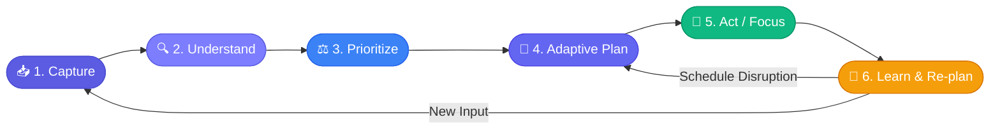
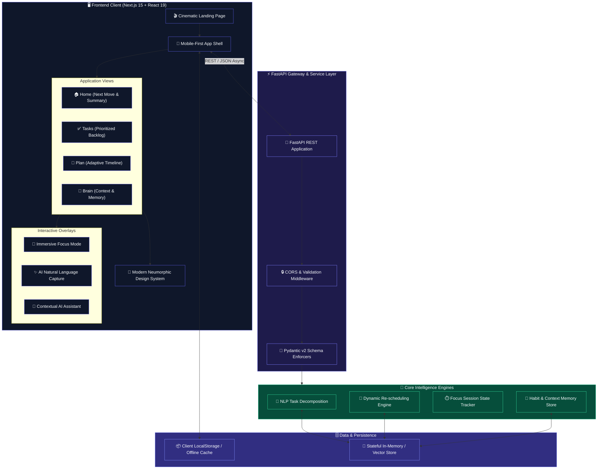

<div align="center">


<br/>

<p align="center">
  
  &nbsp;
  
  &nbsp;
  
  &nbsp;
  
</p>

<p align="center">
  
  &nbsp;
  
  &nbsp;
  
  &nbsp;
  
  &nbsp;
  
  &nbsp;
  
  &nbsp;
  
</p>

<br/>

<p align="center">
  <em><strong>An intelligent personal AI execution companion that transforms scattered daily commitments<br/>into an adaptive, prioritized plan — and answers the only question that matters:</strong></em>
</p>

<h2 align="center">
  
</h2>

<br/>

<p align="center">
  <a href="#-the-flow-paradigm">Paradigm</a> &nbsp;•&nbsp;
  <a href="#%EF%B8%8F-system-architecture">Architecture</a> &nbsp;•&nbsp;
  <a href="#-core-features">Features</a> &nbsp;•&nbsp;
  <a href="#%EF%B8%8F-technology-stack">Stack</a> &nbsp;•&nbsp;
  <a href="#-design-system">Design</a> &nbsp;•&nbsp;
  <a href="#-quick-start">Quick Start</a> &nbsp;•&nbsp;
  <a href="#-api-reference">API</a> &nbsp;•&nbsp;
  <a href="#%EF%B8%8F-roadmap">Roadmap</a>
</p>

</div>

<br/>

---

## 🧠 The FLOW Paradigm

> *Most productivity tools are passive archives. FLOW is an active execution engine.*

Traditional tools pile tasks into an ever-growing inbox. FLOW continuously asks, answers, and adapts — cutting through noise to surface the single most valuable action at any point in time.

<div align="center">

```
        INPUT                     INTELLIGENCE                     OUTPUT
┌─────────────────────┐       ┌──────────────────────┐       ┌─────────────────────┐
│  14 Unread Tasks    │       │                      │       │  ▶ START NOW        │
│  Overdue Project    │  ───► │  "What should I do   │  ───► │    Finish DBMS      │
│  3pm Meeting        │       │     right now?"      │       │    (35m Focus Box)  │
│  Cognitive Overload │       │                      │       │  ✓ Auto Re-planned  │
└─────────────────────┘       └──────────────────────┘       └─────────────────────┘
      CHAOS                        THE QUESTION                     CLARITY
```

</div>

### ⚙️ The Continuous Execution Cycle



<br/>

| Phase | Responsibility | What Happens |
|:---:|:---|:---|
| 📥 **Capture** | Natural Input Ingestion | Unstructured thought dump via typed natural language |
| 🔍 **Understand** | Cognitive Parsing | Extracts task semantics, duration, dependencies & urgency |
| ⚖️ **Prioritize** | Dynamic Scoring | Weighs deadlines, energy levels & available calendar buffers |
| 📅 **Adaptive Plan** | Sequence Assembly | Generates a realistic, non-overlapping daily timeline |
| 🎯 **Act / Focus** | Ambient Deep Work | Single-task execution chamber with countdown & sub-milestones |
| 🔄 **Learn & Re-plan** | Dynamic Self-Healing | Automatically recalibrates downstream tasks upon disruption |

---

## 🏗️ System Architecture

FLOW uses a clean decoupled architecture — separating the client presentation layer from the AI orchestration service.



---

## ✨ Core Features

<table>
  <tr>
    <td width="50%" valign="top">
      <h3>🎯 "What Should I Do Now?"</h3>
      <p>Eliminates decision fatigue with a prominent hero recommendation card — showing <strong>why</strong> a task was selected, its estimated duration, and a 1-tap launch into deep focus.</p>
    </td>
    <td width="50%" valign="top">
      <h3>✨ Natural Language AI Capture</h3>
      <p>Accepts inputs like <em>"Finish DBMS intro due tomorrow, 35 min"</em> and intelligently parses them into structured tasks with duration, priority, and deadline tags.</p>
    </td>
  </tr>
  <tr>
    <td width="50%" valign="top">
      <h3>🔄 Dynamic Adaptive Replanning</h3>
      <p>When disruptions occur, FLOW silently recalculates the remaining schedule — no guilt trips, no broken streaks, just a fresh realistic plan.</p>
    </td>
    <td width="50%" valign="top">
      <h3>🎧 Distraction-Free Focus Mode</h3>
      <p>A full-screen ambient workspace with countdown timer, active sub-step breakdown, tactile controls, and confetti celebrations upon task completion.</p>
    </td>
  </tr>
  <tr>
    <td width="50%" valign="top">
      <h3>🧠 Cognitive Memory & Brain</h3>
      <p>Stores personal productivity context — peak deep-work hours, recurring blockers, preferred sprint lengths — to continuously refine future scheduling.</p>
    </td>
    <td width="50%" valign="top">
      <h3>🎬 Cinematic Landing Experience</h3>
      <p>An immersive, motion-rich narrative that emotionally visualizes the shift from fragmented chaos to unified execution clarity — powered by Framer Motion.</p>
    </td>
  </tr>
</table>

---

## 🛠️ Technology Stack

<div align="center">

| Layer | Technology | Version | Purpose |
|:---|:---:|:---:|:---|
| **Frontend Framework** | [Next.js](https://nextjs.org/) | `15.1.7` | App Router, Server/Client components, optimized builds |
| **UI Library** | [React](https://react.dev/) | `19.0.0` | Concurrent rendering, clean hooks architecture |
| **Language** | [TypeScript](https://www.typescriptlang.org/) | `5.7.3` | Full-stack end-to-end type safety |
| **Styling & Tokens** | [Tailwind CSS](https://tailwindcss.com/) | `3.4.17` | Utility-first styling with custom Neumorphic extension |
| **Animation Engine** | [Framer Motion](https://www.framer.com/motion/) | `12.4.7` | Physics-based springs, layout morphing & gestures |
| **Iconography** | [Lucide React](https://lucide.dev/) | `0.475.0` | Consistent, lightweight vector icon set |
| **Visual FX** | [Canvas Confetti](https://www.npmjs.com/package/canvas-confetti) | `1.9.4` | Micro-reward particle bursts on task completion |
| **Backend API** | [FastAPI](https://fastapi.tiangolo.com/) | `0.115+` | High-performance async REST API framework |
| **Data Validation** | [Pydantic](https://docs.pydantic.dev/) | `v2.x` | Strict type validation & JSON serialization |
| **ASGI Server** | [Uvicorn](https://www.uvicorn.org/) | `0.32+` | Lightning-fast ASGI web server for Python |
| **Runtime** | Node.js & Python | `Node 24+` / `Py 3.12` | Modern cross-platform runtime environments |

</div>

---

## 🎨 Design System

FLOW employs a soft, tactile **Modern Neumorphic Design System** — engineered to feel warm, organic, and calm rather than sterile or visually harsh.

<table>
  <tr>
    <td width="50%" align="center">
      <h4>☀️ Light Mode</h4>
      <pre>
  Background   #F2F3F5
  Surface      #F7F8FA
  Elevated     #FFFFFF
  Accent       #5B5CE2
  Text         #1A1B2E
  Shadow       Soft Raised Diffuse
      </pre>
    </td>
    <td width="50%" align="center">
      <h4>🌙 Dark Mode</h4>
      <pre>
  Background   #0D0E10
  Surface      #15171A
  Elevated     #1B1E22
  Accent       #7C7DFF
  Text         #F1F5F9
  Shadow       Deep Inset / Night
      </pre>
    </td>
  </tr>
</table>

**Design Principles:**
- 🧊 **Soft Elevation** — Surfaces feel touchable via layered box-shadows (no harsh borders)
- 🌊 **Physics-Based Motion** — Every interaction responds with spring-eased animations
- 🎨 **Semantic Color** — Purple = intelligence, Green = success, Amber = caution — all purposeful
- 📐 **Mobile-First** — Every view is touch-optimized before desktop enhancement

---

## 📁 Repository Structure

```
flow/
├── 📄 README.md                   # Project manifesto, architecture & setup guide
├── 🔒 .gitignore                  # Production-grade ignore rules
├── ⚙️  vercel.json                 # Vercel deployment configuration
├── 📦 requirements.txt            # Root Python dependencies
│
├── 🖥️  frontend/                   # Next.js 15 Web Application
│   ├── src/
│   │   ├── app/                   # Next.js App Router
│   │   │   ├── layout.tsx         # Root HTML layout, theme provider & font injection
│   │   │   ├── page.tsx           # Cinematic landing page (Scenes 01–08)
│   │   │   ├── globals.css        # Neumorphic tokens, shadows & animations
│   │   │   └── app/page.tsx       # Core product shell (Home, Tasks, Plan, Brain)
│   │   ├── components/
│   │   │   ├── ui/                # Buttons, cards, pills, inputs & badges
│   │   │   ├── landing/           # Storytelling sections (Chaos → AI → Focus)
│   │   │   ├── app/               # HomeView, TaskList, PlanTimeline, FocusModal
│   │   │   └── theme/             # ThemeContext & ThemeSwitcher
│   │   ├── lib/                   # API client, fallback mock data & utils
│   │   └── types/                 # Task, Schedule, FocusSession & Memory interfaces
│   ├── tailwind.config.ts         # Custom palette & Neumorphic box-shadows
│   ├── tsconfig.json              # Strict TypeScript compiler options
│   └── package.json               # Frontend dependencies & npm scripts
│
└── 🐍 api/                        # FastAPI Python Service
    ├── index.py                   # FastAPI init, CORS & endpoint routers
    ├── models/                    # Pydantic schemas (Task, Plan, Memory)
    ├── services/                  # Scheduling & NLP decomposition logic
    └── routers/                   # Tasks, Plan, Focus, AI & Memory endpoints
```

---

## 📡 API Reference

The backend provides a clean RESTful interface for task orchestration, intelligent replanning, and focus tracking.

<details>
<summary><strong>🔍 View Full API Table</strong></summary>

<br/>

| Method | Endpoint | Description | Body / Params |
|:---:|:---|:---|:---|
|  | `/api/health` | Healthcheck & system status | — |
|  | `/api/tasks` | Fetch all tasks & status | `?status=all\|todo\|completed` |
|  | `/api/tasks` | Create a new task | `TaskCreate` schema |
|  | `/api/tasks/{id}` | Update task status or details | `TaskUpdate` schema |
|  | `/api/tasks/{id}` | Remove a task | — |
|  | `/api/plan` | Fetch adaptive daily timeline | — |
|  | `/api/plan/recalculate` | Trigger adaptive re-plan | `{"disrupted_task_id": "t1"}` |
|  | `/api/ai/recommend` | Compute "What should I do now?" | — |
|  | `/api/focus/start` | Initialize a focus session | `{"task_id": "t1", "duration_minutes": 25}` |
|  | `/api/focus/complete` | Record a completed session | `{"session_id": "s1"}` |
|  | `/api/memories` | Retrieve productivity context | — |

> 📖 **Interactive Docs:** Visit `http://localhost:8000/docs` for the live Swagger UI.

</details>

---

## 🚀 Quick Start

### Prerequisites

| Requirement | Version |
|:---|:---|
| **Node.js** | `v18.18+` or `v20+` / `v24+` |
| **npm** | `v9+` (or `pnpm` / `bun`) |
| **Python** | `v3.10+` or `v3.12+` |

### 1️⃣ Clone & Setup

```bash
git clone https://github.com/srinivas2s/flow.git
cd flow
```

### 2️⃣ Frontend Setup

```bash
cd frontend
npm install
npm run dev
```

> ✅ App live at **http://localhost:3000**

### 3️⃣ Backend Setup

```bash
# From project root
python -m venv venv

# Windows
.\venv\Scripts\activate

# macOS / Linux
source venv/bin/activate

pip install -r requirements.txt
uvicorn api.index:app --reload --port 8000
```

> ✅ API live at **http://localhost:8000** — Swagger UI at **http://localhost:8000/docs**

---

## 🗺️ Roadmap

| Status | Feature | Description |
|:---:|:---|:---|
| ✅ | **AI Task Capture** | Natural language parsing into structured tasks |
| ✅ | **Adaptive Replanning** | Dynamic schedule recalculation on disruption |
| ✅ | **Focus Mode** | Full-screen immersive single-task execution chamber |
| ✅ | **Neumorphic Design** | Light + dark mode with smooth theme transitions |
| ✅ | **Cinematic Landing** | Motion-rich storytelling landing experience |
| 🔨 | **Persistent Auth** | User accounts with secure session management |
| 🔨 | **Calendar Sync** | Google Calendar & Outlook integration |
| 🔨 | **Mobile App** | React Native companion with offline support |
| 💡 | **AI Voice Capture** | Whisper-based voice task input |
| 💡 | **Weekly Reviews** | AI-generated productivity insights & habit reports |
| 💡 | **Team Collaboration** | Shared task boards & synchronized planning |

> ✅ Done &nbsp;|&nbsp; 🔨 In Progress &nbsp;|&nbsp; 💡 Planned

---

## 📄 License

Distributed under the **MIT License** — see the [LICENSE](./LICENSE) file for details.

---

<div align="center">


<br/>

**FLOW** — *Focus · Logic · Orchestration · Workflow*

<sub>Designed with precision for human cognitive clarity.</sub>

<br/>

<sub>
  <a href="https://github.com/srinivas2s/flow/issues">🐛 Report a Bug</a> &nbsp;•&nbsp;
  <a href="https://github.com/srinivas2s/flow/issues">✨ Request a Feature</a> &nbsp;•&nbsp;
  <a href="https://github.com/srinivas2s/flow">⭐ Star on GitHub</a>
</sub>

<br/><br/>

<sub>Made with ❤️ by <a href="https://github.com/srinivas2s">srinivas2s</a></sub>

</div>
