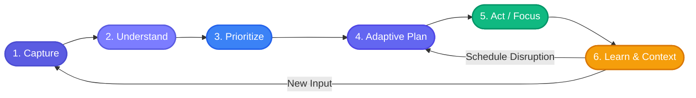
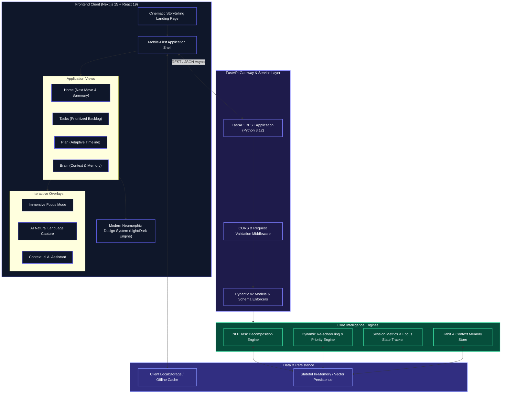

<div align="center">

```
  ███████╗██╗      ██████╗ ██╗    ██╗
  ██╔════╝██║     ██╔═══██╗██║    ██║
  █████╗  ██║     ██║   ██║██║ █╗ ██║
  ██╔══╝  ██║     ██║   ██║██║███╗██║
  ██║     ███████╗╚██████╔╝╚███╔███╔╝
  ╚═╝     ╚══════╝ ╚═════╝  ╚══╝╚══╝ 
```

  # FLOW
  ### **Focus · Logic · Orchestration · Workflow**

  <p align="center">
    <strong>An intelligent personal AI execution companion that turns scattered daily commitments into an adaptive plan and answers the ultimate question: <em>"What should I do right now?"</em></strong>
  </p>

  <p align="center">
    <a href="#the-flow-paradigm"></a>
    <a href="#technology-stack"></a>
    <a href="#technology-stack"></a>
    <a href="#technology-stack"></a>
    <a href="#technology-stack"></a>
    <a href="#license"></a>
  </p>

  <p align="center">
    <a href="#the-flow-paradigm">Paradigm</a> •
    <a href="#system-architecture">Architecture</a> •
    <a href="#core-features">Core Features</a> •
    <a href="#technology-stack">Tech Stack</a> •
    <a href="#neumorphic-design-system">Design System</a> •
    <a href="#quick-start-guide">Quick Start</a> •
    <a href="#backend-api-reference">API Reference</a> •
    <a href="#license">License</a>
  </p>

</div>

---

## The FLOW Paradigm

Most productivity tools act as passive databases: to-do lists that expand indefinitely, calendars requiring constant micro-adjustments, and generic chatbots disconnected from real-time context.

**FLOW operates as an active execution engine** engineered to minimize cognitive overhead and provide actionable guidance at every moment.

<div align="center">

```
  CHAOS & OVERLOAD                    THE CRITICAL QUESTION                    CLARITY & ACTION
┌───────────────────┐               ┌────────────────────────┐               ┌───────────────────┐
│ • 14 Unread Tasks │               │                        │               │ [START NOW]       │
│ • Overdue Project │ ------------> │ "What should I do      │ ------------> │   Finish DBMS     │
│ • 3pm Meeting     │               │        right now?"     │               │   (35m Focus Box) │
│ • Cognitive Noise │               │                        │               │ • Auto Re-planned │
└───────────────────┘               └────────────────────────┘               └───────────────────┘
```

</div>

### The Continuous Execution Cycle



| Phase | Responsibility | Operational Mechanism |
| :--- | :--- | :--- |
| **1. Capture** | Natural Input Ingestion | Unstructured thought dump via quick prompt or typed natural language |
| **2. Understand** | Cognitive Parsing | Extracts task semantics, duration, dependencies, and urgency |
| **3. Prioritize** | Dynamic Scoring | Weighs deadlines, energy levels, and available calendar buffers |
| **4. Adaptive Plan** | Sequence Assembly | Generates a realistic, non-overlapping daily timeline |
| **5. Act / Focus** | Ambient Deep Work | Single-task execution chamber with countdown and sub-milestones |
| **6. Learn & Re-plan** | Dynamic Self-Healing | Automatically recalibrates downstream items upon disruption |

---

## System Architecture

FLOW uses a decoupled architecture separating the client presentation layer from the high-throughput AI orchestration service.



---

## Core Features

<table>
  <tr>
    <td width="50%">
      <h3 align="center">"What Should I Do Now?"</h3>
      <p>Eliminates decision fatigue with a prominent hero recommendation card explaining <strong>why</strong> a task was selected, estimated completion duration, and a 1-tap launch into deep focus.</p>
    </td>
    <td width="50%">
      <h3 align="center">Natural Language AI Capture</h3>
      <p>Accepts natural inputs like <em>"Finish DBMS introduction due tomorrow with 35 min estimated"</em>, parsing them into structured tasks with estimated time and priority tags.</p>
    </td>
  </tr>
  <tr>
    <td width="50%">
      <h3 align="center">Dynamic Adaptive Replanning</h3>
      <p>When unexpected disruptions occur, FLOW recalculates the remaining day's schedule automatically without guilt trips or broken streak penalties.</p>
    </td>
    <td width="50%">
      <h3 align="center">Distraction-Free Focus Mode</h3>
      <p>A full-screen ambient workspace with custom countdown timer, active sub-step breakdown, tactile controls, and celebration animations upon task completion.</p>
    </td>
  </tr>
  <tr>
    <td width="50%">
      <h3 align="center">Cognitive Memory & Brain</h3>
      <p>Stores personal productivity context (e.g., peak deep-work hours, recurring blockers, preferred work sprints) to continuously refine future scheduling.</p>
    </td>
    <td width="50%">
      <h3 align="center">Cinematic Storytelling Landing Page</h3>
      <p>An immersive, motion-rich narrative that visualizes the shift from fragmented chaos to unified execution clarity.</p>
    </td>
  </tr>
</table>

---

## Technology Stack

| Layer | Technology | Version | Purpose & Highlights |
| :--- | :--- | :--- | :--- |
| **Frontend Framework** | [Next.js](https://nextjs.org/) | `15.1.7` | App Router, Server/Client components, optimized builds |
| **UI Library** | [React](https://react.dev/) | `19.0.0` | Modern concurrent rendering, clean hooks architecture |
| **Language** | [TypeScript](https://www.typescriptlang.org/) | `5.7.3` | Full-stack end-to-end type safety and schema alignment |
| **Styling & Tokens** | [Tailwind CSS](https://tailwindcss.com/) | `3.4.17` | Utility-first styling with custom Neumorphic extension |
| **Animation Engine** | [Framer Motion](https://www.framer.com/motion/) | `12.4.7` | Physics-based spring animations, layout morphing & gestures |
| **Iconography** | [Lucide React](https://lucide.dev/) | `0.475.0` | Consistent, lightweight vector icon set |
| **Visual Effects** | [Canvas Confetti](https://www.npmjs.com/package/canvas-confetti) | `1.9.4` | Micro-reward particle bursts upon task completion |
| **Backend API** | [FastAPI](https://fastapi.tiangolo.com/) | `0.115+` | High-performance asynchronous REST API framework |
| **Data Validation** | [Pydantic](https://docs.pydantic.dev/) | `v2.x` | Strict type validation and JSON serialization |
| **ASGI Server** | [Uvicorn](https://www.uvicorn.org/) | `0.32+` | Lightning-fast ASGI web server for Python |
| **Runtime** | Node.js & Python | `Node 24+` / `Py 3.12` | Modern cross-platform runtime environments |

---

## Neumorphic Design System

FLOW employs a soft, tactile **Modern Neumorphic Design System** engineered specifically to look warm, organic, and calm rather than sterile or abrasive.

```
       LIGHT MODE SURFACE                      DARK MODE SURFACE
┌───────────────────────────────┐       ┌───────────────────────────────┐
│  Background: #F2F3F5          │       │  Background: #0D0E10          │
│  Surface:    #F7F8FA          │       │  Surface:    #15171A          │
│  Elevated:   #FFFFFF          │       │  Elevated:   #1B1E22          │
│  Accent:     #5B5CE2          │       │  Accent:     #7C7DFF          │
│  Shadow:     Soft Raised      │       │  Shadow:     Deep Inset/Night │
└───────────────────────────────┘       └───────────────────────────────┘
```

---

## Repository Structure

```text
flow/
├── README.md                    # Project manifesto, architecture & setup guide
├── .gitignore                   # Production ignore rules
│
├── frontend/                    # Next.js 15 Web Application
│   ├── src/
│   │   ├── app/                 # Next.js App Router
│   │   │   ├── layout.tsx       # Root HTML layout, theme provider & font injection
│   │   │   ├── page.tsx         # Cinematic interactive landing page (Scenes 01-08)
│   │   │   ├── globals.css      # Neumorphic tokens, custom shadows & animations
│   │   │   └── app/             # Core Product Experience
│   │   │       ├── page.tsx     # Main application shell (Home, Tasks, Plan, Brain)
│   │   │       └── ...
│   │   ├── components/          # Component Architecture
│   │   │   ├── ui/              # Neumorphic buttons, cards, pills, inputs & badges
│   │   │   ├── landing/         # Storytelling sections (Chaos, AI Reveal, Focus Demo)
│   │   │   ├── app/             # HomeView, TaskList, PlanTimeline, FocusModal, BrainView
│   │   │   └── theme/           # ThemeContext & ThemeSwitcher
│   │   ├── lib/                 # API client, fallback mock dataset & utils
│   │   └── types/               # Task, Schedule, FocusSession & Memory interfaces
│   ├── tailwind.config.ts       # Custom Tailwind palette & Neumorphic box-shadows
│   ├── tsconfig.json            # Strict TypeScript compiler options
│   └── package.json             # Frontend dependencies & npm scripts
│
└── backend/                     # FastAPI Python Service
    ├── app/
    │   ├── main.py              # FastAPI initialization, CORS & endpoint routers
    │   ├── models/              # Pydantic schemas (Task, Plan, Recommendation, Memory)
    │   ├── services/            # Adaptive scheduling & natural language decomposition logic
    │   └── routers/             # Tasks, Plan, Focus, AI and Memory API endpoints
    └── requirements.txt         # Python dependencies (fastapi, uvicorn, pydantic)
```

---

## Backend API Reference

The backend provides a clean RESTful interface for task orchestration, intelligent replanning, and focus tracking.

| Method | Endpoint | Description | Request Body / Params |
| :--- | :--- | :--- | :--- |
| `GET` | `/api/health` | Healthcheck & system status | *None* |
| `GET` | `/api/tasks` | Fetch all user tasks & status | `?status=all\|todo\|completed` |
| `POST` | `/api/tasks` | Create a new task manually | `TaskCreate` schema |
| `PATCH` | `/api/tasks/{id}` | Update task status or details | `TaskUpdate` schema |
| `DELETE` | `/api/tasks/{id}` | Remove a task | *None* |
| `GET` | `/api/plan` | Fetch structured adaptive daily timeline | *None* |
| `POST` | `/api/plan/recalculate` | Trigger recalculation after schedule change | `{"disrupted_task_id": "t1"}` |
| `POST` | `/api/ai/recommend` | Compute optimal "What should I do now?" | *None* |
| `POST` | `/api/focus/start` | Initialize a distraction-free focus session | `{"task_id": "t1", "duration_minutes": 25}` |
| `POST` | `/api/focus/complete` | Record completed focus session & stats | `{"session_id": "s1"}` |
| `GET` | `/api/memories` | Retrieve stored productivity context & habits | *None* |

---

## Quick Start Guide

### Prerequisites
* **Node.js**: v18.18+ or v20+ / v24+
* **npm**: v9+ (or `pnpm` / `bun`)
* **Python**: v3.10+ or v3.12+

### 1. Clone & Setup Workspace

```bash
git clone https://github.com/srinivas2s/flow.git
cd flow
```

### 2. Frontend Setup

```bash
cd frontend
npm install
npm run dev
```
> The frontend application will be live at `http://localhost:3000`.

### 3. Backend Setup

```bash
cd backend
python -m venv venv

# On Windows:
.\venv\Scripts\activate

# On macOS/Linux:
source venv/bin/activate

pip install -r requirements.txt
uvicorn app.main:app --reload --port 8000
```
> The API server will be live at `http://localhost:8000` (Interactive Swagger Docs at `http://localhost:8000/docs`).

---

## License

Distributed under the **MIT License**.

<div align="center">
  <br/>
  <strong>FLOW — Focus, Logic, Orchestration & Workflow</strong><br/>
  <sub>Designed with precision for human cognitive clarity.</sub>
</div>
